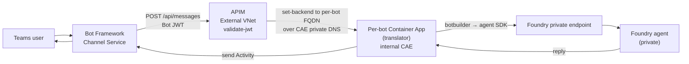

# `publish-agent/` — Publish a Foundry agent to Teams (private Foundry)

The Teams-publishing solution for the parent
[private-Foundry repo](../README.md). One-time setup deploys a shared APIM +
Container Apps Environment + Streamlit UI. After that, **anyone with the right
RBAC can publish a Foundry agent to Teams from a browser in ~2 minutes**.

> **Demo video:** [pf_<your-python-env>.mp4](https://onedrive.cloud.microsoft/:v:/a@ub3eg2k3/S/cQrZnHlnmBskTJ-AoDHyKHKnEgUCA-ywu7iLUlywEFR5yFPyCA)

> ⚠️ **This documents the ORIGINAL per-bot design (v1)** — one Container App per
> published agent, and it assumed a tenant admin for consent. **The shipped
> approach is the shared-router design (v2):** a *single* Container App serves
> every agent, and per-user consent works with **no tenant-admin role** via
> **pre-authorization**. For the current design start at
> **[DESIGN_v2_shared-router-and-preauth.md](DESIGN_v2_shared-router-and-preauth.md)**
> and **[setup/SETUP_SHARED_PLATFORM.md](setup/SETUP_SHARED_PLATFORM.md)**. This
> file is kept for the deep APIM/translator gotchas (JWT audience CSV,
> SingleTenant openid-config, internal-CAE ingress) that **still apply**.

---

## Architecture



**Two persistent layers (one-time setup):**

| Layer | Bicep | Lifetime | Provides |
|---|---|---|---|
| **Bridge (APIM)** | `bootstrap.bicep` | One per tenant | Public ingress, JWT validation, route to translator |
| **Translator runtime** | `bootstrap-translator.bicep` | One per tenant | Internal Container Apps Env + ACR + UAMI for per-bot translator images |

**Per-agent deployment** (`publish-agent.bicep`, ~2 min):

- New **SingleTenant Entra app** for the bot + fresh client secret (stored in Key Vault).
- **Azure Bot Service** (F0) + **Teams channel**.
- **Per-bot Container App** in the shared CAE, pulling a freshly-built translator image from the shared ACR.
- **APIM operation** `POST /bot/agents/{agentId}/messages` whose policy rewrites the backend URL to the per-bot Container App's internal FQDN.
- APIM **api-base policy rewritten** to add the new bot's AppId to the validate-jwt audience list (see [Known gotchas](#known-gotchas)).
- Teams `manifest.template.json` rendered + zipped → `out/<BotShortName>.zip`.

---

## File layout

```
publish-agent/
├── DESIGN_v1_per-bot-container.md          (this file — original per-bot design)
├── bootstrap.bicep / .bicepparam          APIM + base API + JWT policy + DNS link
├── bootstrap-translator.bicep / .param    CAE (internal) + ACR + UAMI
├── publish-agent.bicep / .ps1             per-agent: Bot + Teams + Container App + APIM op
│
├── translator/                            FastAPI + botbuilder translator (~300 LOC)
│
├── policies/
│   ├── api-base.xml                       APIM API-level inbound (validate-jwt, set-backend)
│   └── operation-per-agent-translator.xml APIM operation-level (rewrite to translator FQDN)
│
├── manifest/
│   ├── manifest.template.json             tokens: ${BOT_APP_ID}, ${BOT_DISPLAY_NAME}, ...
│   ├── color.png / outline.png            Teams app icons (replace with org logo)
│
└── streamlit_app/                         Browser UI publisher (deploy once per tenant)
    ├── README.md                          ← deploy + auth + OBO details
    ├── app.py / publisher.py / discovery.py / auth.py / config.py
    ├── arm/publish-agent.json             ← compiled from ../publish-agent.bicep
    ├── Dockerfile + rebuild-arm.ps1
    └── .env.example
```

---

## Prerequisites

**For the platform-team person doing the one-time setup:**

- Privately-networked Foundry account in the target VNet (deployed via
  [../main.bicep](../main.bicep) or equivalent — see
  [../INFRA_PRIVATE_FOUNDRY.md](../INFRA_PRIVATE_FOUNDRY.md)).
- **Owner** (or Contributor + User Access Administrator) on the resource group.
- **Application Administrator** on the tenant — *only if you rely on admin
  consent.* The shipped **v2** approach avoids this entirely via
  **pre-authorization** (an app-owner action, no directory-admin role). See
  [DESIGN_v2_shared-router-and-preauth.md](DESIGN_v2_shared-router-and-preauth.md) §1.
- Azure CLI ≥ 2.60, Bicep CLI ≥ 0.27.
- Providers registered: `Microsoft.ApiManagement`, `Microsoft.App`,
  `Microsoft.BotService`, `Microsoft.CognitiveServices`,
  `Microsoft.ContainerRegistry`, `Microsoft.KeyVault`,
  `Microsoft.ManagedIdentity`, `Microsoft.Network`.
- Quota: APIM Developer SKU (~30 min provision), one CAE, one ACR Basic.

**For end users publishing agents (the per-agent flow):**

- `Azure AI Developer` on the Foundry project (list agents)
- `Contributor` on the publish-target resource group (deploy `publish-agent.bicep`)
- `Key Vault Secrets Officer` on the bot-secrets vault (write secret)
- `AcrPush` on the translator ACR (build per-bot image)
- **No tenant-admin role** — Entra-app creation uses delegated
  `Application.ReadWrite.OwnedBy`, scoped to apps the user owns.

---

## One-time setup (per tenant)

### 1. Bootstrap APIM (~30 min)

Edit `bootstrap.bicepparam` — set `foundryAccountName`, `foundryProjectName`,
`vnetName`, `apimSubnetName`, `keyVaultName`. Then:

```powershell
cd publish-agent
az deployment group create -g <rg> `
  --template-file bootstrap.bicep `
  --parameters bootstrap.bicepparam `
  --name bootstrap-apim
```

Deploys APIM (External VNet) attached to `apim-subnet`; links the three
Foundry private DNS zones to the VNet; creates API `foundry-bot` at path
`bot` with the api-base `validate-jwt` policy from
[`policies/api-base.xml`](policies/api-base.xml); seeds named values
`foundry-backend-url`, `bot-tenant-id`, `allowed-bot-audiences`.

Idempotent. If your tenant already has APIM fronting Foundry you can skip
this as long as it satisfies: External VNet, NIC in the Foundry VNet,
backend = `https://<foundryAccountName>.services.ai.azure.com`, three Foundry
private DNS zones linked.

### 2. Bootstrap the translator runtime (~10 min)

```powershell
az deployment group create -g <rg> `
  --template-file bootstrap-translator.bicep `
  --parameters bootstrap-translator.bicepparam `
  --name bootstrap-translator
```

Deploys: internal **Container Apps Environment** in the CAE subnet, **ACR
Basic**, **User-Assigned Managed Identity** (`AcrPull` on the ACR +
`Azure AI Developer` on the Foundry project), and a small **Azure Storage
Table** for translator state.

Capture the outputs (`caeName`, `caeDefaultDomain`, `acrName`,
`acrLoginServer`, `miName`, `miClientId`, `threadTableUrl`) — they go into
the Streamlit `.env` and per-publish params.

### 3. Deploy the Streamlit publisher (~15 min)

Two target options:

| Target | When to pick |
|---|---|
| **Azure Container Apps** (recommended) | Reuse the CAE from step 2; Easy Auth integrates cleanly; scale-to-zero. |
| **Azure App Service (Linux container)** | Tenants that prefer App Service for governance / log shipping. Same image, same env vars. |

See **[streamlit_app/README.md § Deploy](streamlit_app/README.md#deploy-to-azure)**
for both walkthroughs.

After deploy, the Streamlit URL is what users hit to publish agents.

---

## Per-agent publish

Two equivalent paths — both deploy the **same** compiled ARM template
(`streamlit_app/arm/publish-agent.json`).

### Option A — Browser UI (`streamlit_app`)

1. Sign in via Easy Auth.
2. Pick subscription → Foundry account → project → agent.
3. Enter display name + (optional) icons.
4. Click **Publish**. Progress log shows each step in real time.
5. Click **Download `<DisplayName>.zip`**.

What happens server-side, in order:

1. **Entra app** `bot-<short>-app` created (SingleTenant) with a fresh secret.
2. Secret **written to Key Vault** as `bot-<short>-secret` (tagged with
   `botAppId`, `createdBy`, `createdAt`). The raw value never leaves the server.
3. **Allowed-bot-audiences merged** — new AppId appended to the named value CSV.
4. **Translator image built** via `az acr build` (no local Docker needed),
   pushed to the shared ACR with a timestamped tag.
5. **`publish-agent.bicep` deployed** — per-bot Container App, Azure Bot
   Service (F0), Teams channel, APIM operation.
6. **APIM api-base policy rewritten** to emit one `<value>` per AppId
   (see [Known gotchas](#known-gotchas)).
7. **Teams manifest** rendered + zipped with icons.

### Option B — PowerShell CLI (`publish-agent.ps1`)

```powershell
./publish-agent.ps1 `
  -ResourceGroup    rg-foundry-private `
  -ApimName         apim-foundry-tenant `
  -FoundryAccount   foundry-acct `
  -FoundryProject   default-project `
  -AgentId          asst_xxxxxxxxxxxxxxxx `
  -DisplayName      "Sales Copilot" `
  -BotShortName     sales-copilot `
  -BotSecretsKeyVaultName kv-foundry-bots
```

Same Azure footprint, same `out/<BotShortName>.zip`.

### Revoking a published agent

```powershell
az containerapp delete -g <rg> -n ca-bot-<short> --yes
az bot delete -g <rg> -n bot-<short>
az rest --method DELETE --uri "https://management.azure.com/<apim>/apis/foundry-bot/operations/post-agents-<agentId>-messages?api-version=2024-05-01"
az keyvault secret delete --vault-name <kv> --name bot-<short>-secret
az ad app delete --id <bot-app-id>
```

The Foundry agent itself is unaffected.

---

## Multi-project / multi-Foundry support

| Case | Setup |
|---|---|
| **Multiple projects in same Foundry account** | Works out of the box. Per-bot translator gets the project endpoint as an env var; APIM doesn't need to know. |
| **Multiple Foundry accounts in same / peered VNet** | Works out of the box. Shared APIM + CAE + ACR; per-bot translator picks its account via env var. |
| **Foundry accounts in non-peered VNets** | Peer them (preferred), or stand up a second CAE / second APIM. |

See **[../README.md § Multi-project / multi-Foundry-account against the same APIM](../README.md#multi-project--multi-foundry-account-against-the-same-apim)**
for the full matrix.

---

## Publishing to Teams — personal vs org / team

| Distribution | Who installs | Setup |
|---|---|---|
| **Personal sideload** (1:1 chat) | The end user | Teams Admin Center → *Manage apps* → *Org-wide app settings* → **Allow interaction with custom apps**: ON. User → *Apps* → *Manage your apps* → *Upload a custom app*. No per-app admin approval. Best for pilots / demos. |
| **Org-wide install** | A Teams admin | TAC → *Manage apps* → *Upload new app* → attach to a *Permission policy* + *Setup policy*. |
| **Specific team only** | A team owner | After org-wide upload, team owner adds via *Manage team* → *Apps* → *Built for your org*. |
| **M365 Copilot agent** | Same + Copilot license | Manifest version ≥ 1.17 with `copilotAgents`. The template here is compatible. |
| **Cross-tenant** (Foundry in A, Teams users in B) | Admin in B | Change bot Entra app to **MultiTenant**. See PRIVATE_FOUNDRY_TO_TEAMS.md "Cross-tenant addendum". |

The publisher creates the bot's Entra app as **SingleTenant** by default
(locks bot identity to the Foundry tenant). Override only for cross-tenant
distribution.

---

## Known gotchas

### 1. Container App ingress must be `external = true` (counter-intuitive)

Even though the CAE is **internal** (no public IP, no public DNS), the
per-bot Container App's `ingress.external` must be `true`. Setting it to
`false` makes the envoy frontend return `404 — This Container App is stopped
or does not exist` to clients outside the CAE — including APIM, which sits
in the same VNet but not in the same CAE.

`external: true` inside an internal CAE means **"reachable from the VNet via
the CAE's internal LB FQDN"** — there is still no public IP.

Source: <https://learn.microsoft.com/azure/container-apps/networking?tabs=workload-profiles-env#accessibility-levels>.

### 2. `validate-jwt` does NOT split a CSV named value

The natural-looking pattern:

```xml
<claim name="aud" match="any" separator=",">
  <value>{{allowed-bot-audiences}}</value>   <!-- CSV of AppIds -->
</claim>
```

…does **not** work. The `separator` attribute splits the **JWT's** multi-
valued claim, not the policy `<value>` content. APIM compares against the
literal CSV string and rejects every token with `TokenClaimValueMismatch`.

The publisher rewrites the api-base policy on every publish to emit one
`<value>` per AppId. See
[`streamlit_app/publisher.py::update_api_base_policy`](streamlit_app/publisher.py)
and the [`policies/api-base.xml`](policies/api-base.xml) header comment.

### 3. SingleTenant bots need the tenant openid-config URL too

The api-base policy includes **two** `<openid-config>` URLs:

1. `https://login.botframework.com/v1/.well-known/openidconfiguration` — Bot
   Framework signing keys.
2. `https://login.microsoftonline.com/{{bot-tenant-id}}/v2.0/.well-known/openid-configuration`
   — required for SingleTenant bots; without it: `IDX10501: Signature
   validation failed`.

Both are baked into the policy `bootstrap.bicep` deploys.

### 4. Operation policy uses `set-backend-service`, not `rewrite-uri`

The per-agent operation policy points APIM at the per-bot translator's
internal FQDN with
`<set-backend-service base-url="https://ca-bot-<short>.<caeDefaultDomain>" />`,
overriding the API-level backend. `rewrite-uri` alone would not change the
DNS lookup, which is what needs to switch to the CAE's internal LB.

### 5. The translator does NOT proxy tool execution — debug tools in Foundry first

The translator only relays **chat I/O** (Activity ↔ Foundry assistant
message). All tool calls — File Search, Code Interpreter, AI Search, and
**every MCP tool (delegated data MCP, Graph, SharePoint, custom MCP)** — run
inside the Foundry agent runtime using Foundry's own identity (project MI for
first-party tools; Microsoft-managed ApiHub SP for MCP). The translator never
sees them.

Practical consequences:

- **If a tool works in the Foundry playground, it works in Teams via the
  translator with no changes.**
- **If a tool fails in the playground (e.g., `S2S registration validation
  failed for servicePrincipal` on a delegated MCP), the translator
  cannot fix it.** Reproduce and fix upstream — backend SP grants, data-catalog
  permissions, ApiHub connector registration, network reach to a
  private-linked downstream.
- **There is no per-user identity passthrough.** All Teams users share the
  same downstream identity (Foundry MI or ApiHub SP). No Unity-Catalog
  per-user RLS, no per-user audit. This is a Foundry-platform limitation,
  not a translator gap. See the parent
  [README — "What the translator does NOT proxy"](../README.md#what-the-translator-does--and-does-not--proxy).

### 6. Rich content (cards, citations, images) is not yet mapped

The translator currently sends plain text + simple Markdown. File Search
citation footnotes, Code Interpreter image outputs, and inline tool-call
traces come back as truncated text or are dropped. The extension point is
`_format_assistant_message` in the translator source — add Adaptive Card
mappers there as needed.

---

## What this buys you (vs. one App Service per bot)

| | This (APIM + translator on CAE) | Python bot in App Service per agent |
|---|---|---|
| App code per agent | none (same translator image) | ~200 LOC + custom auth |
| Iterate on bugfix | redeploy translator image once → all bots get it | zip → deploy → restart per bot |
| Cold start | CAE scale-to-zero: ~3s | App Service Plan minimum SKU always-on |
| Auth | APIM `validate-jwt` (config) | `BotFrameworkAdapter` per bot |
| Per-agent cost idle | ~$0 | $13+/mo per App Service Plan |
| Provisioning time per agent | ~2 min (one ARM deploy) | 10+ min |

The only thing you give up is fine-grained per-agent control over the
botbuilder pipeline. The default translator covers the 90% case: send
message → run agent → return reply, with conversation state in the Foundry
thread.
